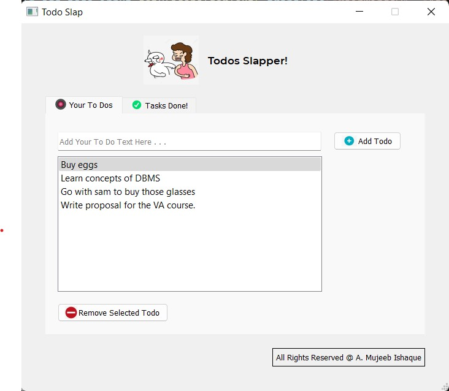
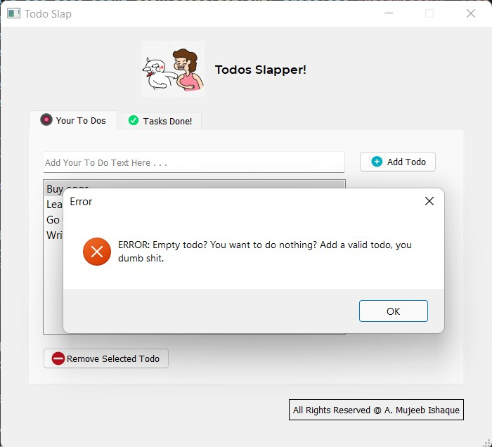
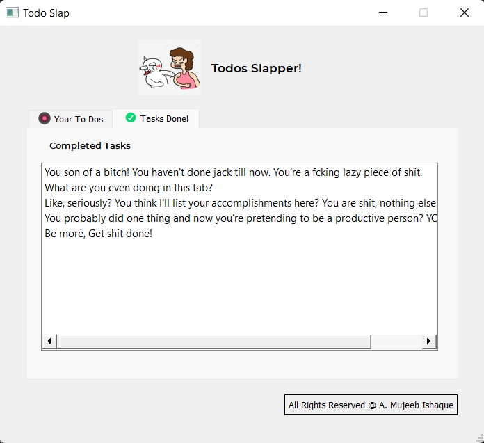

# todo-slap
My personal project for myself To Slap me with my todos when my pc wakes up

### Where to download the executable of the software?
- You can download the executable from this repo. It's placed inside the `output` folder.

### How does the software look like?
- Following are the 3 screenshots of the software:
- 
- 
- 

### What are the software requirements?
- Windows 10+

### How to make it load on startup so I'm slapped with my todos?
- Place the exe inside your `startup` folder.
- For Example, in my case the startup folder is here: `C:\Users\Dell\AppData\Roaming\Microsoft\Windows\Start Menu\Programs\Startup`

### What libs did I use?
- Pyqt5
- TinyDB
- Tkinter MessageBoxes

### Database of choice?
- I used tinyDB which uses .json file as a database. It's efficient and very easy to use.

### Can I copy your code to make it mine or sell it to others?
- You're allowed to do whatever you want to do with the source code or software but `I'll request to please include my name @mujeebishaque`. Thank You :) 
